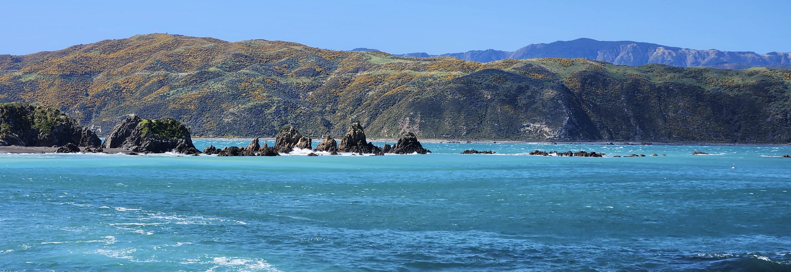
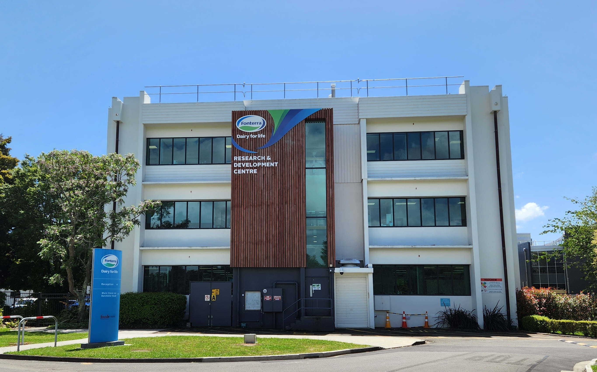
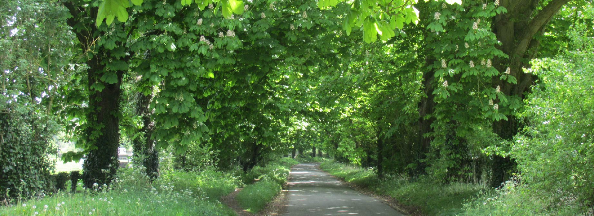

{.homepage-photo fig-alt="View from Breaker Bay"}

## Employment

::: {.cv-entry}

::: {.cv-years}
2023–Present
:::

::: {.cv-main}

### Marine Biosecurity Scientist

**Earth Sciences New Zealand (formerly NIWA)**

Work on a wide variety of biosecurity, industry and biodiversity-focused research projects, typically involving genetic and genomic methods applied in marine and freshwater environments.
:::

::: {.cv-image}


:::

:::


::: {.cv-entry}

::: {.cv-years}
2021–2023
:::

::: {.cv-main}

### Research Scientist

**Fonterra Co-operative Group**

Primarily worked on whole-genome and metagenomic sequencing for an environmental and food-borne pathogen management programme. Alongside lab and bioinformatic work, led client reporting and assisted with database development.

2022-2023: Research Scientist

2021-2022: Associate Research Scientist
:::

::: {.cv-image}



:::

:::

::: {.cv-entry}

::: {.cv-years}
2019-2021
:::

::: {.cv-main}

### Postdoctoral Fellow

**University of Otago**

Researched the genomic diversity of *Durvillaea* southern bull kelp and investigated the impact of major earthquake uplift events on coastal ecosystems.

Supervised by Jon Waters, funded by Marsden Grant 18-UOO-172.
:::

::: {.cv-image}


:::

:::


::: {.cv-entry}

::: {.cv-years}
2018-2019
:::

::: {.cv-main}

### Postdoctoral Research Associate

**Oregon State University**

Investigated population genomic diversity in albacore tuna, deacon rockfish and Arctic charr. 

Supervised by Kathleen O'Malley, funded by Saltonstall-Kennedy Grant NA17NMF4270220.
:::

::: {.cv-image}


:::

:::

## Education

::: {.cv-entry}

::: {.cv-years}
2013-2017
:::

::: {.cv-main}

### PhD in Evolutionary Biology

**Massey University**

[Thesis: Evolutionary lineages and the diversity of New Zealand true whelks](http://hdl.handle.net/10179/13113)

Investigated the diversity and systematics of extant and fossil buccinid marine snails, focusing on *Penion* whelks. Learnt phylogenetic, population genomic and geometric morphometric theory and analyses, as well genetic and palaeontological methods.

Supervised by Mary Morgan-Richards, Steve Trewick, and James Crampton, funded by Marsden Grant 12-MAU-008.
:::

::: {.cv-image}


:::

:::


::: {.cv-entry}

::: {.cv-years}
2009-2013
:::

::: {.cv-main}

### BSc Hons in Evolutionary Biology with Study Abroad

**University of Exeter**

*First-Class Honours; Dean’s Commendation*

Final year research project: Phylodynamics of three bumblebee viruses

Dissertation: The continuity and importance of heterospecific information use

Mentors: Lena Bayer-Wilfert, David Hosken.
:::

::: {.cv-image}


:::


::: {.cv-years}
2011-2012
:::

::: {.cv-main}

### Study Abroad

**University of Southern Mississippi**

Major: Biology

Minor: Archaeology

:::

::: {.cv-image}


:::

:::

## Research journey

```{r}
#| echo: false
#| warning: false
#| message: false

library(leaflet)
library(dplyr)
library(readr)
library(geosphere)

# ------------------------------------------------------------
# Load and order journey data
# ------------------------------------------------------------

travel <- read_csv("data/cv_locations.csv") |>
  mutate(date = as.Date(date)) |>
  arrange(date) |>
  mutate(
    journey_order = row_number(),
    original_lat = lat,
    original_lon = lon
  )

# ------------------------------------------------------------
# Separate overlapping points
# ------------------------------------------------------------

travel <- travel |>
  group_by(original_lat, original_lon) |>
  mutate(
    coordinate_count = n()
  ) |>
  ungroup()

# Apply a reproducible random offset of 0.5–1 km
# only where coordinates are duplicated
set.seed(123)

for (i in seq_len(nrow(travel))) {

  if (travel$coordinate_count[i] > 1) {

    bearing <- runif(1, 0, 360)
    distance <- runif(1, 500, 1000)

    shifted <- geosphere::destPoint(
      p = c(
        travel$original_lon[i],
        travel$original_lat[i]
      ),
      b = bearing,
      d = distance
    )

    travel$lon[i] <- shifted[1]
    travel$lat[i] <- shifted[2]
  }
}

# ------------------------------------------------------------
# Hover text
# ------------------------------------------------------------

travel <- travel |>
  mutate(
    hover_text = ifelse(
      is.na(institution) | institution == "",
      paste0(
        "<strong>", format(date, "%Y"), " – ", title, "</strong><br>",
        location
      ),
      paste0(
        "<strong>", format(date, "%Y"), " – ", title, "</strong><br>",
        institution, "<br>",
        location
      )
    )
  )

# ------------------------------------------------------------
# Draw map
# ------------------------------------------------------------

leaflet(travel) |>

  addProviderTiles(
    providers$CartoDB.Positron,
    options = providerTileOptions(
      noWrap = TRUE
    )
  ) |>

  # Connect locations in chronological order
  addPolylines(
    lng = travel$lon,
    lat = travel$lat,
    weight = 2,
    opacity = 0.65,
    color = "#2f6f8f"
  ) |>

  # Interactive journey points
  addCircleMarkers(
    lng = ~lon,
    lat = ~lat,
    radius = 7,
    stroke = TRUE,
    color = "#ffffff",
    weight = 1.5,
    fillColor = "#2f6f8f",
    fillOpacity = 0.95,

    label = lapply(
      travel$hover_text,
      htmltools::HTML
    ),

    labelOptions = labelOptions(
      direction = "auto",
      opacity = 1,
      textsize = "13px"
    )
  ) |>

  # Chronological numbers positioned beside each point
  addLabelOnlyMarkers(
    lng = ~lon,
    lat = ~lat,
    label = ~as.character(journey_order),
    labelOptions = labelOptions(
      noHide = TRUE,
      direction = "right",
      offset = c(6, 0),
      textOnly = TRUE,
      textsize = "13px",
      style = list(
        "color" = "#2f6f8f",
        "font-weight" = "700"
      )
    )
  ) |>

  fitBounds(
    lng1 = min(travel$lon),
    lat1 = min(travel$lat),
    lng2 = max(travel$lon),
    lat2 = max(travel$lat)
  )
```

<div class="photo-spacer"></div>
<div class="photo-spacer"></div>

{.homepage-photo fig-alt="Horse chestnut avenue into Lockinge"}