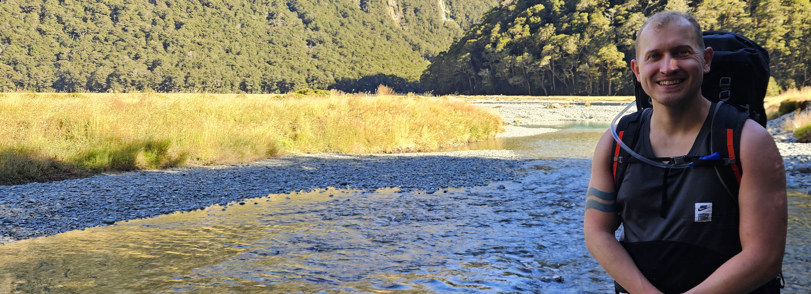
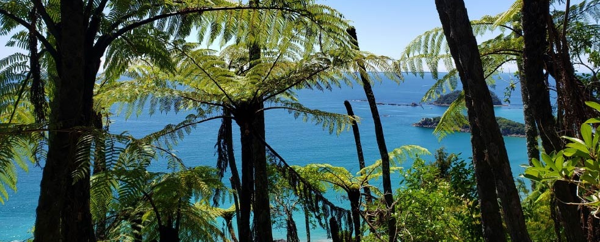

{.homepage-photo fig-alt="Felix Zareie-Vaux on the Routeburn track"}

## About

Kia ora, I'm a **Marine Biosecurity Scientist at Earth Sciences New Zealand**. By trade, I'm an **evolutionary biologist** with expertise in evolutionary ecology, genomics, biosecurity, and programming. I live and work in Wellington / Te Whanganui-a-Tara in New Zealand / Aotearoa, and I grew up in rural Oxfordshire in the UK.

Throughout my career, I’ve applied emerging genomic methods and analyses to a wide variety of species, including many unusual 'non-model' aquatic organisms. I use the exciting insight provided by genomics to test evolutionary and ecological hypotheses, and my research assists with the interpretation, management and conservation of populations and species. 

I equally enjoy both basic 'blue skies' and applied research, and I've led investigations on behalf of government and industry. I strongly value open science and clear scientific communication so that stakeholders and wider society can receive the greatest benefit from my work. I support Māori-led research, and I'm always eager to involve te ao Māori and to facilitate the data sovereignty directives of my iwi and hapū partners on shared projects.

Please feel free to [contact me](mailto:felixvaux.evolution@gmail.com) if you want to collaborate, ask questions, or access papers or data. 

I'm always interested in supporting, training and supervising postgraduate students, although students must be enrolled at a university and co-supervised by a staff member there.

## Publications and data

[View publications and data →](publications.qmd)

## CV

[View employment and education →](cv.qmd)

## Elsewhere online

[Discover my online outreach activity and watch videos→](online.qmd)

## Contact

[View my contact details→](contact.qmd)

{.homepage-photo fig-alt="View from Mt Maunganui"}
