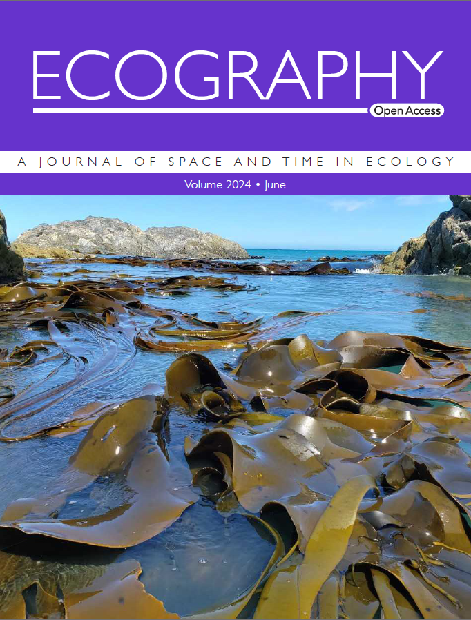
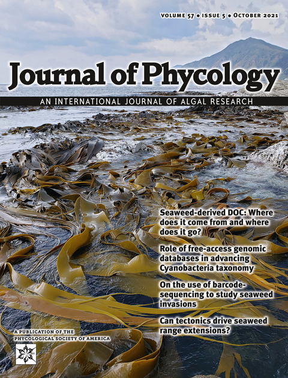
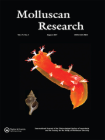

Here's a list of my publications with their associated data. Don't hesitate to email me to access a paper or to ask any questions!

Most papers are published with online supplementary material. Code, analysis files, and processed genetic sequence data (e.g. demultiplexed reads, SNP files, or alignments) have been archived for most publications in repositories. Where raw data (e.g. original DNA sequences or morphometric photos) are unavailable, please contact me or my former supervisors for access. My [GitHub page](https://github.com/fvaux) has code for most studies I have led.

You can also view my publications on my [ORCID](https://orcid.org/0000-0002-2882-7996), [Web of Science](https://www.webofscience.com/wos/author/record/V-6883-2019), and [GoogleScholar](https://scholar.google.com/citations?user=opPJEhoAAAAJ) profiles. Web of Science also lists my verified peer reviews.

## *Submitted*
::: {.publication}

Pearson RA, Preston G, Bulleid J, David S, **Zareie-Vaux F**, Clements D, Tait LW. Accelerated development and deployment of computer vision models for invasive aquatic pests. *Submitted to Scientific Reports*.

::: {.publication-links}

[Zenodo](https://doi.org/10.5281/zenodo.16864825)

:::

:::

## 2026
::: {.publication}

Carmelet-Rescan D, Trewick SA, Bridger C, Pohe SR, Morgan-Richards M, **Zareie-Vaux F**. Are species distribution models using climate variables suitable to forecast the changing distribution of freshwater organisms? *Freshwater Biology* (accepted).

::: {.publication-links}

[Figshare](https://doi.org/10.6084/m9.figshare.30757607) · [GenBank: PP778198–PP778299](https://www.ncbi.nlm.nih.gov/nuccore/?term=PP778198%3APP778299%5BACCN%5D)

:::

:::

::: {.publication}

Samsing F, Arbon P, Arnold M, Barnes AC, Bass D, Becker JA, Bennette J, Caraguel C, Carson J, Costa VA, Dumond T, Geoghegan J, Hutson KS, Knowles G, Knowles J, Lockton K, Pope M, Rudenko O, Sullivan R, **Zareie-Vaux F**, Williams J, Wiley K. (2026). High-throughput sequencing in aquaculture disease investigations: challenges and opportunities for implementation. *Reviews in Aquaculture* 18, e70193. [10.1111/raq.70193](https://doi.org/10.1111/raq.70193)

:::

::: {.publication}

Lane HS, Bilewitch JP, Brooks AS, Smith L, Pomarède M, Dymond M, Michael KP, **Zareie-Vaux F**. (2026). Concurrent infections by *Bonamia* species (Haplosporidia) do not cause more intense infections. *Parasitology* 153, 103–110. [10.1017/S0031182025100978](https://doi.org/10.1017/S0031182025100978)

:::

## 2024
::: {.publication}

**Vaux F**, Parvizi E, Duffy GA, Dutoit L, Craw D, Waters JM, Fraser CI. (2024). First genomic snapshots of recolonising lineages following a devastating earthquake. *Ecography* 2024, e07117. [10.1111/ecog.07117](https://doi.org/10.1111/ecog.07117)

::: {.publication-links}

[GitHub](https://doi.org/10.5281/zenodo.10724645) · [SRA: PRJNA780921](https://www.ncbi.nlm.nih.gov/sra/PRJNA780921) · [Ecography blog post](https://www.ecography.org/blog/tracking-ecological-recovery-real-time-using-genomics-impact-high-magnitude-earthquake) · [Issue cover](https://www.ecography.org/content/june-2024)

:::

:::

::: {.publication}

Pearman WS, Morales SE, **Vaux F**, Gemmell NJ, Fraser CI. (2024). Host population crashes disrupt the diversity of associated marine microbiomes. *Environmental Microbiology* 26, e16611. [10.1111/1462-2920.16611](https://doi.org/10.1111/1462-2920.16611)

::: {.publication-links}

[GitHub](https://github.com/wpearman1996/Kaikoura_EQ) · [Aotearoa Genomic Data Repository: NZ-00038-AGDR00038](https://doi.org/10.57748/12AX-YB78) · [Preprint](https://doi.org/10.1101/2023.02.08.527737)

:::

:::

## 2023
::: {.publication}

**Vaux F**, Fraser CI, Craw D, Read S, Waters JM. (2023). Integrating kelp genomic analyses and geological data to reveal ancient earthquake impacts. *Journal of the Royal Society Interface* 20, 20230105. [10.1098/rsif.2023.0105](https://doi.org/10.1098/rsif.2023.0105)

::: {.publication-links}

[GitHub](https://doi.org/10.5281/zenodo.8361940) · [SRA: PRJNA780921](https://www.ncbi.nlm.nih.gov/sra/PRJNA780921)

:::

:::

::: {.publication}

**Vaux F**, Dutoit L, Fraser CI, Waters JM. (2023). Genotyping-by-sequencing for biogeography. *Journal of Biogeography* 50, 262–281. [10.1111/jbi.14516](https://doi.org/10.1111/jbi.14516)

:::

## 2022
::: {.publication}

**Vaux F**, Parvizi E, Craw D, Fraser CI, Waters JM. (2022). Parallel recolonisations generate distinct genomic sectors in kelp following high magnitude earthquake disturbance. *Molecular Ecology* 31, 4818–4831. [10.1111/mec.16535](https://doi.org/10.1111/mec.16535)

::: {.publication-links}

[Dryad](https://doi.org/10.5061/dryad.jdfn2z3bt) · [GitHub](https://github.com/fvaux/turakirae_d_antarctica_GBS) · [SRA: PRJNA769149](https://www.ncbi.nlm.nih.gov/bioproject/PRJNA769149)

:::

:::

::: {.publication}

Thomas LJ, Milotic M, **Vaux F**, Poulin R. (2022). Lurking in the water: testing eDNA metabarcoding as a tool for ecosystem-wide parasite detection. *Parasitology* 149, 261–269. [10.1017/S0031182021001840](https://doi.org/10.1017/S0031182021001840)

::: {.publication-links}

[ResearchGate](https://www.researchgate.net/publication/357776533_joined_reads) · [Cambridge Core blog post](https://www.cambridge.org/core/blog/2022/02/25/finding-all-of-the-parasites/)

:::

:::

## 2021
::: {.publication}

Song W, Xie Y, Sun M, Li X, Fitzpatrick CK, **Vaux F**, O’Malley KG, Zhang Q, Qi J, He Y. (2021). A duplicated *amh* is the master sex-determining gene for *Sebastes* rockfish in the Northwest Pacific. *Open Biology* 11, 210063. [10.1098/rsob.210063](https://doi.org/10.1098/rsob.210063)

::: {.publication-links}

[SRA: PRJNA656655](https://www.ncbi.nlm.nih.gov/bioproject/PRJNA656655/) · [GenBank: MW591738–MW591743](https://www.ncbi.nlm.nih.gov/nuccore/?term=MW591738%3AMW591743%5BACCN%5D)

:::

:::

::: {.publication}

**Vaux F**, Craw D, Fraser CI, Waters JM. (2021). Northward range extension for *Durvillaea poha* bull kelp: response to tectonic disturbance? *Journal of Phycology* 57, 1411–1418. [10.1111/jpy.13179](https://doi.org/10.1111/jpy.13179)

::: {.publication-links}

[Dryad](https://doi.org/10.5061/dryad.v41ns1rw6) · [GitHub](https://github.com/fvaux/north_island_d_poha_GBS) · [SRA: PRJNA683976](https://www.ncbi.nlm.nih.gov/bioproject/683976) · [GenBank: MZ097484–MZ097511](https://www.ncbi.nlm.nih.gov/nuccore/?term=MZ097484%3AMZ097511%5BACCN%5D)
 · [Issue cover](https://doi.org/10.1111/jpy.12873)

:::

:::

::: {.publication}

**Vaux F**, Bohn S, Hyde JR, O'Malley KGO. (2021). Adaptive markers distinguish North and South Pacific Albacore amid low population differentiation. *Evolutionary Applications* 14, 1343–1364. [10.1111/eva.13202](https://doi.org/10.1111/eva.13202)

::: {.publication-links}

[Dryad](https://doi.org/10.5061/dryad.6djh9w103) · [GitHub](https://github.com/fvaux/pacific_albacore_ddRADseq) · [SRA: PRJNA579774](https://www.ncbi.nlm.nih.gov/bioproject/579774)

:::

:::

## 2020
::: {.publication}

**Vaux F**, Gemmell MR, Hills SFK, Marshall BA, Beu AG, Crampton JSC, Trewick SA, Morgan-Richards M. (2020). Lineage identification affects estimates of evolutionary mode in marine snails. *Systematic Biology* 69, 1106–1121. [10.1093/sysbio/syaa018](https://doi.org/10.1093/sysbio/syaa018)

::: {.publication-links}

[Dryad](https://doi.org/10.5061/dryad.gqnk98sh6) · [GitHub](https://github.com/fvaux/PhD_morphometrics) · [2020 Dryad with all NCBI accessions](https://doi.org/10.5061/dryad.gqnk98sh6) · [SRA: PRJNA564825](https://www.ncbi.nlm.nih.gov/bioproject/564825) · [GenBank: all mitogenomes](https://www.ncbi.nlm.nih.gov/nuccore/?term=MK577960%5BACCN%5D%20OR%20MH198157%5BACCN%5D%20OR%20MK577961%5BACCN%5D%20OR%20MH198159%5BACCN%5D%20OR%20MK577962%5BACCN%5D%20OR%20MH140430%5BACCN%5D%20OR%20MH198156%5BACCN%5D%20OR%20MH198173%5BACCN%5D%20OR%20MH198172%5BACCN%5D%20OR%20MK558053%5BACCN%5D%20OR%20MH198158%5BACCN%5D%20OR%20MK577963%5BACCN%5D%20OR%20MH198162%5BACCN%5D%20OR%20MK577965%5BACCN%5D%20OR%20MK577964%5BACCN%5D%20OR%20MK558051%5BACCN%5D%20OR%20MK583343%5BACCN%5D%20OR%20MH198163%5BACCN%5D%20OR%20MK558054%5BACCN%5D%20OR%20MK558055%5BACCN%5D%20OR%20MH198161%5BACCN%5D%20OR%20MH198160%5BACCN%5D%20OR%20MK583342%5BACCN%5D%20OR%20MH140429%5BACCN%5D%20OR%20MH140428%5BACCN%5D%20OR%20MH140431%5BACCN%5D%20OR%20MH140432%5BACCN%5D%20OR%20MH198171%5BACCN%5D%20OR%20MH198170%5BACCN%5D%20OR%20MH198165%5BACCN%5D%20OR%20MH198166%5BACCN%5D%20OR%20MG211145%5BACCN%5D%20OR%20MG211144%5BACCN%5D%20OR%20MH198168%5BACCN%5D%20OR%20MH198167%5BACCN%5D%20OR%20MH198169%5BACCN%5D%20OR%20MH198164%5BACCN%5D%20OR%20MG098232%5BACCN%5D%20OR%20MK583341%5BACCN%5D%20OR%20MK558052%5BACCN%5D)
 
:::

:::

::: {.publication}

**Vaux F**, Aycock HM, Bohn S, Rasmuson LK, O’Malley KG. (2020). Sex identification PCR-RFLP assay tested in eight species of *Sebastes* rockfish. *Conservation Genetics Resources* 12, 541–544. [10.1007/s12686-020-01150-y](https://doi.org/10.1007/s12686-020-01150-y)

::: {.publication-links}

[Dryad](https://doi.org/10.5061/dryad.1jwstqjqx)

:::

:::

## 2019
::: {.publication}

**Vaux F**, Rasmuson LK, Kautzi LA, Rankin PS, Blume MTO, Lawrence KA, Bohn S, O’Malley KG. (2019). Sex matters: otolith shape and genomic variation in deacon rockfish (*Sebastes diaconus*). *Ecology and Evolution* 9, 13153–13173. [10.1002/ece3.5763](https://doi.org/10.1002/ece3.5763)

::: {.publication-links}

[Dryad](https://doi.org/10.5061/dryad.8kprr4xj0) · [GitHub](https://github.com/fvaux/deacon_rockfish_RADseq) · [SRA: PRJNA560239](https://www.ncbi.nlm.nih.gov/bioproject/560239)

:::

:::

::: {.publication}

O’Malley KG, **Vaux F**, Black AN. (2019). Characterizing neutral and adaptive genomic differentiation in a changing climate: the most northerly freshwater fish as a model. *Ecology and Evolution* 9, 2004–2017. [10.1002/ece3.4891](https://doi.org/10.1002/ece3.4891)

::: {.publication-links}

[Dryad](https://doi.org/10.5061/dryad.8hq6qv2)

:::

:::

::: {.publication}

**Vaux F**, Daly EE, Morgan-Richards M, Trewick SA. (2019). Tuatara and a new morphometric dataset for Rhynchocephalia: a response to Herrera-Flores et al. *Palaeontology* 62, 321–334. [10.1111/pala.12402](https://doi.org/10.1111/pala.12402)

::: {.publication-links}

[Dryad](https://doi.org/10.5061/dryad.ms7q2q4) · [GitHub](https://github.com/fvaux/PhD_morphometrics)

:::

:::

## 2018
::: {.publication}

Gemmell MR, Trewick SA, Crampton JS, **Vaux F**, Hills SFK, Daly EE, Marshall BA, Beu AG, Morgan-Richards M. (2018). Genetic structure and shell shape variation within a rocky shore whelk suggest both diverging and constraining selection with gene flow. *Biological Journal of the Linnean Society* 125, 827–843. [10.1093/biolinnean/bly142](https://doi.org/10.1093/biolinnean/bly142)

::: {.publication-links}

[GenBank: MH198158–MH198162](https://www.ncbi.nlm.nih.gov/nuccore/?term=MH198158%3AMH198162%5BACCN%5D)

:::

:::

::: {.publication}

**Vaux F**, Crampton JSC, Trewick SA, Marshall BA, Beu AG, Hills SFK, Morgan-Richards M. (2018). Evolutionary lineages of marine snails identified using molecular phylogenetics and geometric morphometric analysis of shells. *Molecular Phylogenetics and Evolution* 127, 626–637. [10.1016/j.ympev.2018.06.009](https://doi.org/10.1016/j.ympev.2018.06.009)

::: {.publication-links}

[Mendeley](http://dx.doi.org/10.17632/kxnfyz73sh.1) · [GitHub](https://github.com/fvaux/PhD_morphometrics) · [2020 Dryad with all GenBank accessions](https://doi.org/10.5061/dryad.gqnk98sh6) · [GenBank: all mitogenomes](https://www.ncbi.nlm.nih.gov/nuccore/?term=MK577960%5BACCN%5D%20OR%20MH198157%5BACCN%5D%20OR%20MK577961%5BACCN%5D%20OR%20MH198159%5BACCN%5D%20OR%20MK577962%5BACCN%5D%20OR%20MH140430%5BACCN%5D%20OR%20MH198156%5BACCN%5D%20OR%20MH198173%5BACCN%5D%20OR%20MH198172%5BACCN%5D%20OR%20MK558053%5BACCN%5D%20OR%20MH198158%5BACCN%5D%20OR%20MK577963%5BACCN%5D%20OR%20MH198162%5BACCN%5D%20OR%20MK577965%5BACCN%5D%20OR%20MK577964%5BACCN%5D%20OR%20MK558051%5BACCN%5D%20OR%20MK583343%5BACCN%5D%20OR%20MH198163%5BACCN%5D%20OR%20MK558054%5BACCN%5D%20OR%20MK558055%5BACCN%5D%20OR%20MH198161%5BACCN%5D%20OR%20MH198160%5BACCN%5D%20OR%20MK583342%5BACCN%5D%20OR%20MH140429%5BACCN%5D%20OR%20MH140428%5BACCN%5D%20OR%20MH140431%5BACCN%5D%20OR%20MH140432%5BACCN%5D%20OR%20MH198171%5BACCN%5D%20OR%20MH198170%5BACCN%5D%20OR%20MH198165%5BACCN%5D%20OR%20MH198166%5BACCN%5D%20OR%20MG211145%5BACCN%5D%20OR%20MG211144%5BACCN%5D%20OR%20MH198168%5BACCN%5D%20OR%20MH198167%5BACCN%5D%20OR%20MH198169%5BACCN%5D%20OR%20MH198164%5BACCN%5D%20OR%20MG098232%5BACCN%5D%20OR%20MK583341%5BACCN%5D%20OR%20MK558052%5BACCN%5D)

:::

:::

::: {.publication}

Marshall BA, Hills SFK, **Vaux F**. (2018). A new species of *Penion* P. Fischer, 1884 from northern New Zealand (Mollusca: Neogastropoda: Buccinoidea). *Molluscan Research* 38, 238–242. [10.1080/13235818.2017.1420398](https://doi.org/10.1080/13235818.2017.1420398)

:::

::: {.publication}

**Vaux F**, Hills SFK, Marshall BA, Trewick SA, Morgan-Richards M. (2018). Genome statistics and phylogenetic reconstructions for Southern Hemisphere whelks (Gastropoda: Buccinulidae). *Data in Brief* 16, 172–181. [10.1016/j.dib.2017.11.021](https://doi.org/10.1016/j.dib.2017.11.021)

::: {.publication-links}

[This is a published supplement for a previous paper](https://doi.org/10.1016/j.ympev.2017.06.018)

:::

:::

## 2017
::: {.publication}

**Vaux F**, Hills SFK, Marshall BA, Trewick SA, Morgan-Richards M. (2017). A phylogeny of Southern Hemisphere whelks (Gastropoda: Buccinulidae) and concordance with the fossil record. *Molecular Phylogenetics and Evolution* 114, 367–381. [10.1016/j.ympev.2017.06.018](https://doi.org/10.1016/j.ympev.2017.06.018)

::: {.publication-links}

[Supplement was published separately](https://doi.org/10.1016/j.dib.2017.11.021) · [2020 Dryad with all GenBank accessions](https://doi.org/10.5061/dryad.gqnk98sh6) · [GenBank: all mitogenomes](https://www.ncbi.nlm.nih.gov/nuccore/?term=MK577960%5BACCN%5D%20OR%20MH198157%5BACCN%5D%20OR%20MK577961%5BACCN%5D%20OR%20MH198159%5BACCN%5D%20OR%20MK577962%5BACCN%5D%20OR%20MH140430%5BACCN%5D%20OR%20MH198156%5BACCN%5D%20OR%20MH198173%5BACCN%5D%20OR%20MH198172%5BACCN%5D%20OR%20MK558053%5BACCN%5D%20OR%20MH198158%5BACCN%5D%20OR%20MK577963%5BACCN%5D%20OR%20MH198162%5BACCN%5D%20OR%20MK577965%5BACCN%5D%20OR%20MK577964%5BACCN%5D%20OR%20MK558051%5BACCN%5D%20OR%20MK583343%5BACCN%5D%20OR%20MH198163%5BACCN%5D%20OR%20MK558054%5BACCN%5D%20OR%20MK558055%5BACCN%5D%20OR%20MH198161%5BACCN%5D%20OR%20MH198160%5BACCN%5D%20OR%20MK583342%5BACCN%5D%20OR%20MH140429%5BACCN%5D%20OR%20MH140428%5BACCN%5D%20OR%20MH140431%5BACCN%5D%20OR%20MH140432%5BACCN%5D%20OR%20MH198171%5BACCN%5D%20OR%20MH198170%5BACCN%5D%20OR%20MH198165%5BACCN%5D%20OR%20MH198166%5BACCN%5D%20OR%20MG211145%5BACCN%5D%20OR%20MG211144%5BACCN%5D%20OR%20MH198168%5BACCN%5D%20OR%20MH198167%5BACCN%5D%20OR%20MH198169%5BACCN%5D%20OR%20MH198164%5BACCN%5D%20OR%20MG098232%5BACCN%5D%20OR%20MK583341%5BACCN%5D%20OR%20MK558052%5BACCN%5D)
 · [Audioslides (YouTube)](https://youtu.be/8aZDsd5x4XA)

:::

:::

::: {.publication}

**Vaux F**, Marshall BA, Crampton JS, Trewick SA, Morgan-Richards M. (2017). Geometric morphometric analysis reveals that the shells of male and female siphon whelks *Penion chathamensis* are the same size and shape. *Molluscan Research* 37, 194–201. [10.1080/13235818.2017.1279474](https://doi.org/10.1080/13235818.2017.1279474)

::: {.publication-links}

[GitHub](https://github.com/fvaux/PhD_morphometrics) · [Issue cover](https://www.tandfonline.com/toc/tmos20/37/3)

:::

:::

::: {.publication}

**Vaux F**, Trewick SA, Morgan-Richards M. (2017). Speciation through the looking-glass. *Biological Journal of the Linnean Society* 120, 480–488. [10.1111/bij.12872](https://doi.org/10.1111/bij.12872)

:::

## 2016
::: {.publication}

**Vaux F**, Trewick SA, Morgan-Richards M. (2016). Lineages, splits and divergence challenge whether the terms anagenesis and cladogenesis are necessary. *Biological Journal of the Linnean Society* 117, 165–176. [10.1111/bij.12665](https://doi.org/10.1111/bij.12665)

:::

## Issue covers

A few of my papers have featured as issue covers...

::: {.cover-grid}

::: {.cover-item}

[{fig-alt="Ecography issue cover"}](https://www.ecography.org/content/june-2024)

**Ecography**  
June 2024

:::

::: {.cover-item}

[{fig-alt="Journal of Phycology issue cover"}](https://doi.org/10.1111/jpy.12873)

**Journal of Phycology**  
October 2021

:::

::: {.cover-item}

[{fig-alt="Molluscan Research issue cover"}](https://www.tandfonline.com/toc/tmos20/37/3)

**Molluscan Research**  
August 2017

:::

:::